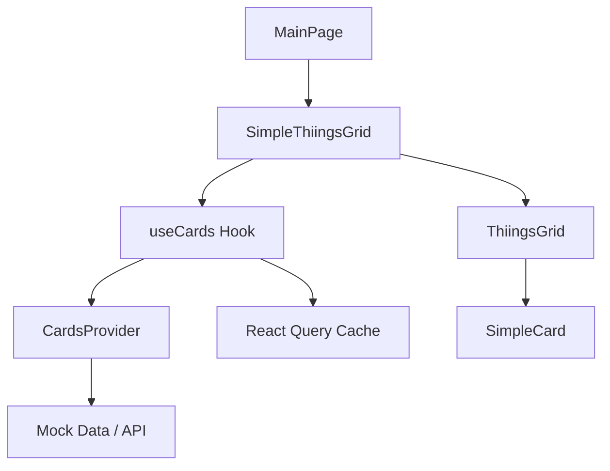

# Things Grid Architecture Analysis

## Overview

Decoded 메인 페이지는 `ThiingsGrid`라는 고성능 무한 그리드 컴포넌트를 기반으로 한 콘텐츠 탐색 인터페이스를 구현합니다. 이 시스템은 Instagram이나 Pinterest와 유사한 스크롤 가능한 그리드 레이아웃을 제공하면서도, 독특한 나선형 인덱싱과 물리학 기반 상호작용을 특징으로 합니다.

## 핵심 구조

### 1. 컴포넌트 계층구조

```
MainPage (src/app/page.tsx)
└── SimpleThiingsGrid (src/domains/main/components/SimpleThiingsGrid.tsx)
    ├── ThiingsGrid (src/domains/main/components/ThiingsGrid.tsx) [핵심 그리드 엔진]
    ├── SimpleCard (메모화된 카드 컴포넌트)
    └── useCards Hook (데이터 관리)
```

### 2. 데이터 흐름



## ThiingsGrid 핵심 특징

### 1. 나선형 인덱싱 시스템
- **중심점 기반**: 그리드 중심(0,0)에서 시작하여 나선형으로 확장
- **계층별 배치**: 각 레이어별로 아이템을 순차적으로 배치
- **효율적 계산**: `getItemIndexForPosition` 함수로 O(1) 인덱스 계산

```typescript
// 위치 기반 인덱스 계산 예시
getItemIndexForPosition(0, 0) // 0 (중심)
getItemIndexForPosition(1, 0) // 1 (첫 번째 레이어 시작)
getItemIndexForPosition(0, -1) // 2
```

### 2. 물리학 기반 상호작용
- **관성 시뮬레이션**: 드래그 후 자연스러운 감속
- **속도 평활화**: 3개 프레임의 이동 평균으로 부드러운 움직임
- **적응형 마찰**: 속도에 따른 차별화된 감속 적용
- **120fps 최적화**: 8ms 간격 업데이트로 고프레임레이트 구현

### 3. 성능 최적화
- **뷰포트 기반 렌더링**: 화면에 보이는 아이템만 렌더링
- **버퍼 영역**: 1셀 버퍼로 스크롤 시 깜빡임 방지
- **메모화**: React.memo와 useMemo로 불필요한 리렌더링 방지
- **스로틀링**: 그리드 업데이트를 8ms 간격으로 제한

## SimpleCard 컴포넌트 분석

### 1. 4:5 비율 최적화
```typescript
const cardStyle = {
  width: '80%',        // 그리드 셀의 80% 너비
  height: '100%',      // 그리드 셀의 100% 높이
  aspectRatio: '4/5',  // Instagram 스타일 비율
}
```

### 2. 시각적 피드백
- **상호작용 상태**: `isMoving` props로 크기/투명도 변화
- **배경색 적용**: 카드의 avgColor로 로딩 상태 개선
- **그라데이션 오버레이**: 하단 메타데이터 가독성 확보

### 3. 반응형 그리드 크기
```typescript
const gridSize = useMemo(() => {
  if (width < 768) return 200;   // 모바일
  if (width < 1024) return 225;  // 태블릿
  return 250;                    // 데스크탑
}, []);
```

## 데이터 관리 (useCards Hook)

### 1. React Query 통합
- **무한 스크롤**: `useInfiniteQuery`로 페이지별 데이터 로딩
- **캐시 최적화**: TTL 기반 스마트 캐싱
- **에러 처리**: 지수 백오프와 재시도 로직
- **낙관적 업데이트**: 사용자 경험 개선

### 2. 커서 기반 페이지네이션
```typescript
getNextPageParam: (lastPage) => {
  return lastPage.hasMore ? lastPage.nextCursor : undefined
}
```

### 3. 데이터 프리로딩
- **뷰포트 예측**: 다음에 보일 카드들을 미리 로딩
- **우선순위 기반**: `loadPriority`에 따른 선택적 프리로딩

## 기술적 혁신 요소

### 1. Class Component 기반 최적화
- **직접 DOM 조작**: React 렌더링 오버헤드 최소화
- **애니메이션 최적화**: requestAnimationFrame 직접 관리
- **메모리 효율성**: 컴포넌트 라이프사이클 정교한 제어

### 2. 커스텀 유틸리티 함수
- **debounce/throttle**: 외부 라이브러리 없이 자체 구현
- **거리 계산**: 효율적인 벡터 연산
- **터치/마우스 통합**: 하나의 핸들러로 모든 입력 처리

### 3. 웹 표준 활용
- **Intersection Observer**: 무한 스크롤 구현
- **Passive Event Listeners**: 스크롤 성능 최적화
- **CSS transform3d**: GPU 가속 활용

## 성능 메트릭

### 1. 렌더링 성능
- **타겟 프레임레이트**: 120fps (8ms 업데이트 간격)
- **메모리 사용량**: 뷰포트 아이템만 DOM에 유지
- **GPU 가속**: transform3d로 하드웨어 가속 활용

### 2. 네트워크 최적화
- **배치 로딩**: 50개 아이템씩 묶어서 요청
- **이미지 지연 로딩**: loading="lazy" 속성 활용
- **캐시 전략**: React Query의 스테일 타임 활용

## 확장성 고려사항

### 1. 타입 안전성
- **완전한 TypeScript**: 모든 컴포넌트와 훅에 타입 정의
- **제네릭 활용**: 재사용 가능한 컴포넌트 구조
- **런타임 검증**: 데이터 유효성 검사 함수 제공

### 2. 모듈화
- **도메인 기반 구조**: main 도메인으로 관련 기능 격리
- **훅 추상화**: 비즈니스 로직과 UI 분리
- **Provider 패턴**: 데이터 계층 교체 가능

### 3. 개발자 경험
- **디버그 모드**: development 환경에서 성능 정보 표시
- **에러 경계**: 명확한 에러 처리 및 폴백 UI
- **개발 도구**: Query DevTools 통합

## 아키텍처 강점

1. **고성능**: 물리학 기반 자연스러운 인터랙션
2. **확장성**: 무한 스크롤과 효율적인 메모리 관리
3. **유지보수성**: 명확한 관심사 분리와 타입 안전성
4. **사용자 경험**: 부드러운 애니메이션과 즉각적인 반응성
5. **모바일 최적화**: 터치 제스처와 반응형 디자인

## 개선 가능한 영역

1. **서버 컴포넌트 전환**: Next.js 13+ 기능 활용 고려
2. **가상화 개선**: 더 큰 데이터셋 처리를 위한 최적화
3. **접근성**: 키보드 네비게이션과 스크린 리더 지원
4. **SEO**: 검색 엔진 최적화를 위한 메타데이터 개선
5. **PWA**: 오프라인 기능과 백그라운드 동기화

---

*이 분석은 2024년 8월 기준으로 작성되었으며, 향후 업데이트될 수 있습니다.*