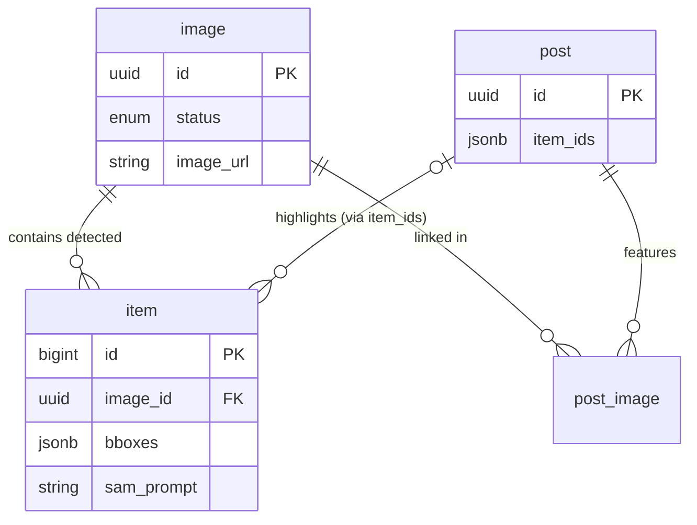

# Database Schema Usage Guide

> **Last updated:** 2025-12-18
> **Source of truth:** `db MCP` snapshot + `Supabase` migrations

## 0. Scope & Purpose

> **Note:** This document summarizes the **domain-level usage** of `image`, `item`, `post`. It is not an exhaustive list of every column but focuses on fields critical to the pipeline and frontend.

This document outlines the **current usage patterns** for the `image`, `item`, and `post` tables.
It focuses on:

- Which pipelines populate the data
- How the frontend/backend consumes it
- The semantic meaning of `enum` and `jsonb` fields

Use this guide to understand the domain logic behind the schema, rather than just a list of columns.

---

## 1. Table: `image`

Primary table for storing uploaded fashion images and their processing status.

### 1.1 Key Columns & Enums

- **`id`**: `uuid` (PK)
- **`status`**: `enum image_status`
  - `pending`: Initial state after upload.
  - `extracted`: Items have been successfully detected and extracted.
  - `skipped`: Image was processed but no items were found or it was invalid.
  - `extracted_metadata`: **(New)** Metadata (tags, colors, etc.) has been extracted, but item detection might still be pending or separate.
- **`with_items`**: `boolean` - Flag indicating if items have been associated with this image.
- **`image_url`**: `text` - Public URL of the uploaded image.

### 1.2 Usage Flow

1.  **Upload**: User uploads an image -> `pending` record created.
2.  **AI Pipeline**:
    - Analyzes image.
    - Updates status to `extracted_metadata` or `extracted`.
    - Populates `item` table if items are found.
    - Sets `with_items = true`.
3.  **Frontend**:
    - `useLatestImages` fetches images ordered by `created_at`.
    - Displays status badges based on the enum.

### 1.3 Example Query (Supabase Client)

```typescript
// lib/supabase/queries/images.ts

// Fetch latest images that have items or are processed
const { data, error } = await supabase
  .from("image")
  .select("*, item(*)") // Join with items
  .not("image_url", "is", null)
  .order("created_at", { ascending: false })
  .limit(20);
```

---

## 2. Table: `item`

Stores individual fashion items detected within an `image`.

### 2.1 Key Columns

- **`image_id`**: `uuid` (FK -> `image.id`)
- **`product_name`** / **`brand`**: `text` - Basic metadata.
- **`sam_prompt`**: `text` - The prompt used for the Segment Anything Model (SAM) to localize this item.
- **`bboxes`**: `jsonb` - Array of bounding boxes for the detected item.
  - Structure: `Array<{ x: number, y: number, w: number, h: number }>` (Normalized 0-1 coordinates)
- **`scores`**: `jsonb` - Confidence scores for the detection/segmentation.
- **`ambiguity`**: `boolean` - `true` if the AI was uncertain about the detection.
- **`cropped_image_path`**: `text` - Path to the cropped version of this specific item.
- **`status`**: `text` (default: `'active'`) - Status of the item (e.g., could be used for moderation).
- **`description`**: `text` - Optional description or notes about the item.

### 2.2 TypeScript Type Definition (App-Level)

Since `jsonb` fields often result in `any` or `Json` types, we define specific interfaces for usage:

```typescript
export interface BBox {
  x: number;
  y: number;
  w: number;
  h: number;
}

export type ItemWithParsedData = Database["public"]["Tables"]["item"]["Row"] & {
  bboxes: BBox[] | null;
  scores: number[] | null;
};
```

### 2.3 Example Query

```typescript
// lib/supabase/queries/items.ts

const { data } = await supabase
  .from("item")
  .select("*")
  .eq("image_id", imageId)
  .order("created_at", { ascending: true });
```

### 2.4 Item Image Field Mapping

**Critical**: The `cropped_image_path` field must be explicitly mapped when transforming database items to UI components.

| DB Column            | TypeScript Type (DbItem) | Transform Function | UI Type (UiItem)           | Component Prop  |
| -------------------- | ------------------------ | ------------------ | -------------------------- | --------------- |
| `cropped_image_path` | `string \| null`         | `normalizeItem()`  | `imageUrl: string \| null` | `item.imageUrl` |

**Transformation Location**: `lib/components/detail/types.ts:normalizeItem()`

```typescript
export function normalizeItem(item: DbItem): UiItem {
  return {
    ...item,
    imageUrl: item.cropped_image_path || null, // Explicit mapping
    // ... other normalized fields
  };
}
```

**Why This Matters**:

- Database uses `snake_case` (`cropped_image_path`)
- UI components use `camelCase` (`imageUrl`)
- The mapping must happen in `normalizeItem()` to ensure data flows correctly
- If this mapping is missing, item images won't display

**See Also**: `docs/database/03-data-flow.md` for complete data flow documentation

---

## 3. Table: `post`

Represents social posts that may feature multiple items.

### 3.1 Key Columns

- **`item_ids`**: `jsonb`
  - Stores references to `item` records displayed in this post.
  - Structure: `string[]` (Array of `item.id`s). Current schema uses `string` for item keys.
  - **Denormalized Helper Column**: `post.item_ids`는 post가 직접 다루는 대표 item id 목록을 denormalized 형태로 저장한 컬럼이다.
  - **Source of Truth**: 실제 정규 관계는 `post_image`, `image`, `item`으로 표현된다. 이 컬럼은 쿼리 최적화를 위한 편의 컬럼이며, `post_image`가 source of truth로 사용될 수 있다.
  - **Data Consistency**: 따라서 Post 생성/수정 로직 구현 시 `item_ids`와 실제 관계 테이블 간의 데이터 정합성을 맞추는 작업이 필수적이다.
- **`article`**: `text` - Optional article content or description for the post.

### 3.2 Usage

- Used to render "Shop the look" style posts where one post highlights multiple detected items.

---

## 4. Table: `post_image`

Join table linking posts to images, with additional metadata about item locations.

### 4.1 Key Columns

- **`post_id`**: `uuid` (FK -> `post.id`) - References the post.
- **`image_id`**: `uuid` (FK -> `image.id`) - References the image.
- **`created_at`**: `timestamptz` - When this post-image association was created.
- **`item_locations`**: `jsonb` - Stores location/coordinate data for items within this specific image in the context of the post. This may differ from the item's original detection coordinates.
- **`item_locations_updated_at`**: `timestamptz` - When the item locations were last updated.

### 4.2 Usage

- **Primary Purpose**: Many-to-many relationship between posts and images.
- **Item Locations**: When a post curator adjusts or confirms item positions for display, these coordinates are stored in `item_locations` rather than modifying the original `item.center` data.
- **Timestamp Tracking**: `item_locations_updated_at` tracks when manual adjustments were made.

---

## 5. Entity Relationship Diagram (ERD)



---

## 6. Using `db MCP` for Verification

When in doubt about the current schema state, use the MCP tool to check the live database definition.

**Instructions:**

1.  Ask Cursor Agent: "List tables image, item, post using db mcp"
    - Tool: `mcp_supabase-decoded-ai_list_tables`
2.  Review the output for:
    - New columns
    - Changed enum values
    - Foreign key constraints

> **Rule:** When updating this document, always verify against a fresh MCP snapshot.

---

## 7. Changelog

- **2025-12-18**: Added missing fields discovered via MCP verification:
  - `item.description` (text, nullable)
  - `post.article` (text, nullable)
  - `post_image.item_locations` (jsonb, nullable)
  - `post_image.item_locations_updated_at` (timestamptz, nullable)
  - Added dedicated section for `post_image` table documentation
- **2025-12-11**: Initial version (Snapshot based on `db MCP` for `image`, `item`, `post`).
